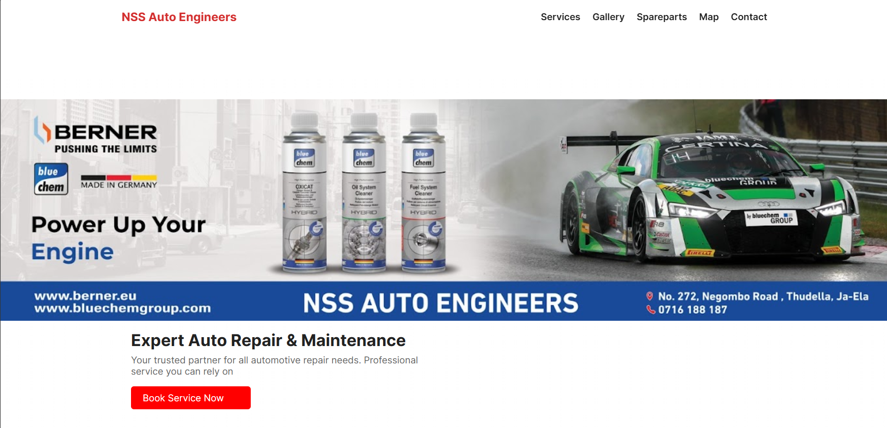

# NSS Auto Engineers Website

A professional, responsive single-page website designed for **NSS Auto Engineers**, an automobile repair and maintenance workshop based in Ja-Ela, Sri Lanka.


_(Note: Please add a screenshot of your website to the assets folder and name it screenshot.png)_

## 📖 Overview

This project serves as the digital storefront for the workshop, allowing customers to view services, browse common spare parts, view the gallery, and book appointments directly. The site is built with performance and user experience in mind, featuring a clean modern design.

## ✨ Features

- **Responsive Design:** Fully optimized for mobile, tablet, and desktop screens.
- **Service Showcase:** detailed sections for Engine, Brake, Transmission, and AC repair.
- **Interactive Gallery:** A lightbox gallery implementation to showcase workshop photos and recent projects.
- **Spare Parts Catalog:** A clean grid layout displaying available parts (Brake pads, Filters, Spark plugs, etc.).
- **Floating Navigation:** Smart navbar that hides on scroll down and reappears on scroll up.
- **Contact Form:** Functional AJAX contact form that sends emails directly to `info@nssauto.lk` without page reloads.
- **Location Map:** Embedded Google Map for easy workshop location finding.

## 🛠️ Technologies Used

- **HTML5:** Semantic markup.
- **CSS3:** Custom variables, Flexbox, and CSS Grid for layout.
- **JavaScript (Vanilla):** DOM manipulation, event handling, and Fetch API for the contact form.
- **FormSubmit.co:** Backend service for handling form submissions without a server.

## 🚀 How to Run

1.  Clone or download this repository.
2.  Ensure the folder structure is maintained:
    ```text
    /
    ├── index.html
    ├── css/
    │   └── styles.css
    ├── js/
    │   └── main.js
    └── assets/
        └── (images...)
    ```
3.  Open `index.html` in any modern web browser.

## ⚙️ Configuration

### Contact Form Setup

The contact form uses **FormSubmit.co** to send emails.

1.  When you first deploy the site, fill out the contact form yourself.
2.  Check the inbox of `info@nssauto.lk`.
3.  Click the "Activate" button in the email received from FormSubmit.co.
4.  The form will now work for all visitors.

## 📞 Contact

**NSS Auto Engineers**

- **Address:** Negombo - Colombo Main Rd, Ja-Ela
- **Phone:** +94716188187
- **Email:** info@nssauto.lk
